<a name="readme-top"></a>

<div align="center">
  <h1>Meilisearch Admin</h1>

  <p align="center">
    <a href="README.md">English</a> | <b>简体中文</b>
  </p>

  <p>
    基于 Web 的现代化 Meilisearch 实例管理界面
  </p>

  <p>
    <a href="https://github.com/itbaymax/meilisearch-admin/blob/main/LICENSE">
      
    </a>
    <a href="https://www.python.org/">
      
    </a>
    <a href="https://vuejs.org/">
      
    </a>
    <a href="https://www.meilisearch.com/">
      
    </a>
  </p>
</div>

## 目录

- [项目介绍](#项目介绍)
- [功能特性](#功能特性)
- [系统架构](#系统架构)
- [快速开始](#快速开始)
- [功能截图](#功能截图)
- [配置说明](#配置说明)
- [参与贡献](#参与贡献)

## 项目介绍

**Meilisearch Admin** 是一个功能完整的 Meilisearch 搜索引擎管理面板。它提供了友好的可视化界面，替代传统的 curl 命令和代码配置方式，让 Meilisearch 的管理变得简单高效。

### 为什么选择 Meilisearch Admin？

- **可视化管理**：直观的 UI 界面管理索引、文档和配置
- **多实例支持**：在一个面板中管理多个 Meilisearch 实例
- **实时搜索预览**：即时测试搜索查询并查看结果
- **完整配置控制**：通过界面配置所有索引设置
- **任务监控**：追踪索引任务及其状态
- **API 密钥管理**：安全地管理 API 密钥，支持显示/隐藏控制

### 项目背景

Meilisearch 官方镜像缺少 UI 管理界面，日常运维需要通过 curl 命令或代码调用 API。本项目旨在：

1. 提供友好的界面交互方式
2. 统一管理多个 Meilisearch 实例
3. 简化索引配置、文档管理等操作
4. 可视化展示任务状态和搜索结果

## 功能特性

| 模块 | 功能描述 |
|------|----------|
| **项目管理** | 添加和管理多个 Meilisearch 实例，支持连接测试 |
| **索引管理** | 创建、配置和删除索引，支持批量操作 |
| **文档操作** | 添加、编辑、删除和搜索文档，支持 JSON/CSV 导入 |
| **配置管理** | 完整的索引设置控制（属性、排序规则、同义词、容错设置等） |
| **任务监控** | 查看和管理索引任务，支持状态筛选 |
| **密钥管理** | 创建和管理 API 密钥，细粒度权限控制 |
| **搜索预览** | 实时搜索测试，支持表格/JSON 视图和相关度评分 |
| **多语言** | 支持中文和英文界面切换 |
| **主题切换** | 支持科技蓝、粉红、暗黑、白色四种主题 |

## 系统架构

```
meilisearch-admin/
├── backend/                 # Python Flask API 服务端
│   ├── api/                 # RESTful API 接口
│   ├── models/              # SQLAlchemy ORM 模型
│   ├── services/            # Meilisearch 客户端服务
│   └── utils/               # 工具类和辅助函数
├── frontend/                # Vue 3 + Vite 前端应用
│   ├── src/
│   │   ├── api/             # HTTP 客户端和 API 调用
│   │   ├── components/      # 可复用 Vue 组件
│   │   ├── views/           # 页面组件
│   │   ├── store/           # Pinia 状态管理
│   │   └── router/          # Vue Router 路由配置
│   └── dist/                # 生产构建输出
├── config/                  # YAML 配置文件
├── bin/                     # 启动脚本
├── data/                    # SQLite 数据库存储
└── logs/                    # 应用日志
```

### 技术栈

**后端：**
- Python 3.10+
- Flask (Web 框架)
- SQLAlchemy (ORM)
- Meilisearch Python Client

**前端：**
- Vue 3 (Composition API)
- Vite (构建工具)
- Pinia (状态管理)
- Tailwind CSS (样式框架)
- Vue Router (路由)

## 快速开始

### 环境要求

- Python 3.10+
- Node.js 18+
- npm 或 yarn
- 运行中的 Meilisearch 实例

### 安装部署

<details open>
<summary><b>方式一：本地部署</b></summary>

<br/>

**1. 克隆项目**
```bash
git clone https://github.com/itbaymax/meilisearch-admin.git
cd meilisearch-admin
```

**2. 配置 Python 环境**
```bash
# 创建虚拟环境
python -m venv venv

# 激活虚拟环境
# Windows:
venv\Scripts\activate
# Linux/macOS:
source venv/bin/activate

# 安装依赖
pip install -r requirements.txt
```

**3. 配置前端**
```bash
cd frontend
npm install
npm run build
cd ..
```

**4. 启动应用**
```bash
# 启动前端服务
cd frontend && npm run dev

# 启动后端服务
python -m backend.app

# 前端页面: http://localhost:8080
# 后端 API: http://localhost:5000
```

</details>

<details>
<summary><b>方式二：开发模式（热更新）</b></summary>

<br/>

**终端 1 - 后端：**
```bash
# 激活虚拟环境
source venv/bin/activate  # Windows 使用 venv\Scripts\activate

# 以调试模式启动 Flask
python -m backend.app
# 后端 API: http://localhost:5000
```

**终端 2 - 前端：**
```bash
cd frontend
npm run dev
# 前端开发服务器: http://localhost:8080
```

</details>

<details>
<summary><b>方式三：Docker 部署（推荐生产环境）</b></summary>

<br/>

**1. 使用 docker-compose 一键部署**
```bash
# 克隆项目
git clone https://github.com/itbaymax/meilisearch-admin.git
cd meilisearch-admin

# 构建并启动服务
docker-compose up -d

# 访问地址: http://localhost:8080
```

**2. 使用 Docker 手动构建**
```bash
# 构建镜像
docker build -t meilisearch-admin:latest .

# 运行容器
docker run -d -p 8080:80 \
  -v $(pwd)/data:/app/data \
  -v $(pwd)/logs:/app/logs \
  -v $(pwd)/config:/app/config:ro \
  --name meilisearch-admin \
  meilisearch-admin:latest
```

**3. 查看容器状态**
```bash
# 查看运行状态
docker-compose ps

# 查看日志
docker-compose logs -f

# 停止服务
docker-compose down
```

**目录挂载说明：**

| 挂载路径 | 说明 |
|----------|------|
| `./data:/app/data` | SQLite 数据库持久化 |
| `./logs:/app/logs` | 应用日志持久化 |
| `./config:/app/config:ro` | 配置文件（只读） |

**环境变量：**

| 变量名 | 描述 | 默认值 |
|--------|------|--------|
| `TZ` | 时区 | `Asia/Shanghai` |
| `FLASK_ENV` | 运行环境 | `production` |

</details>

### 开始使用

1. 在浏览器中打开 `http://localhost:5000`
2. 点击「添加项目」注册您的 Meilisearch 实例
3. 输入 Meilisearch 地址（如 `http://localhost:7700`）和 API Key
4. 开始管理您的索引！

## 功能截图

> 以下为功能模块说明和功能展示。

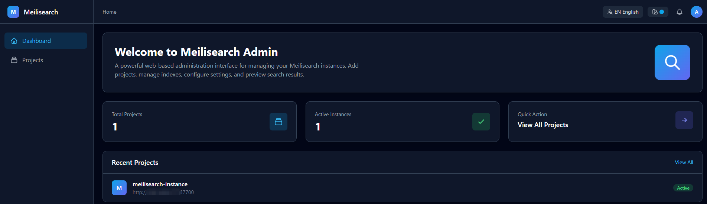

### 项目仪表盘

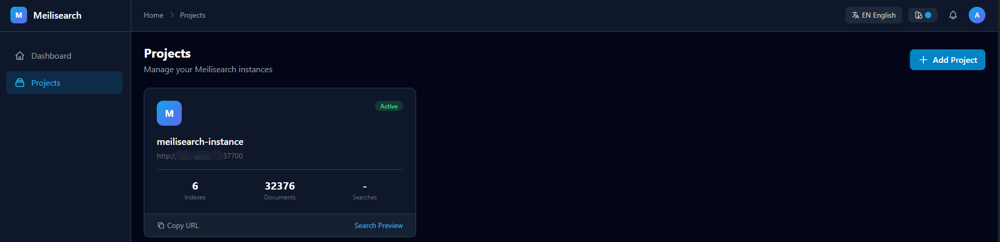
*主仪表盘展示所有已注册的 Meilisearch 实例及关键指标（索引数、文档数、搜索次数）*

**主要功能：**
- 项目卡片展示实例基本信息
- 支持复制地址和 API Key
- 快速跳转到搜索预览

<div align="center">
      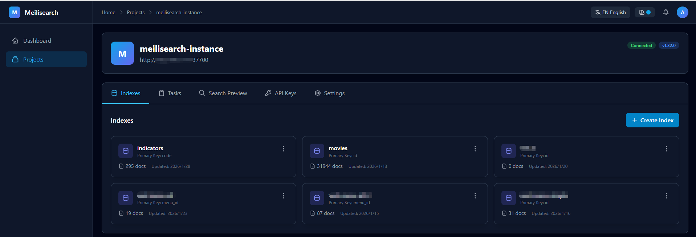
</div>

<div align="center">
      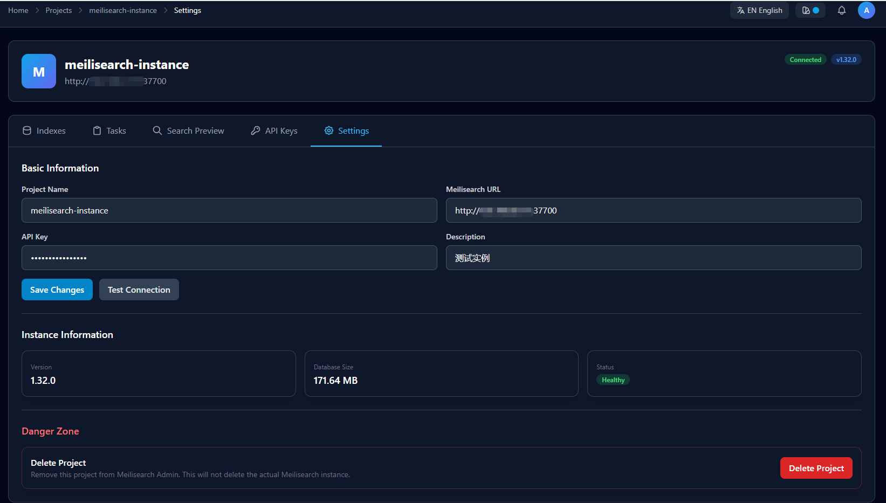
</div>

### 索引管理

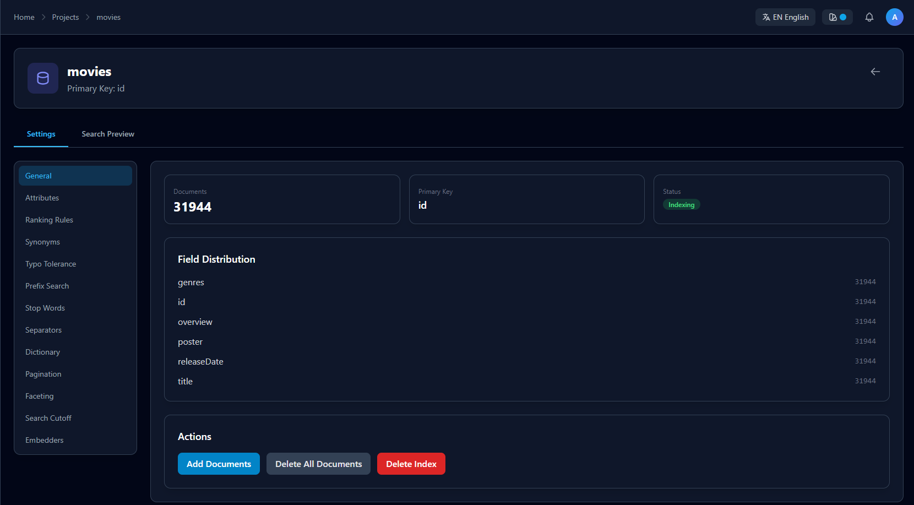 
*索引列表视图，展示文档数量、状态和快捷操作*

**主要功能：**
- 索引卡片展示状态、文档数、更新时间
- 支持创建、删除索引
- 批量导入文档（JSON/CSV）

### 索引配置

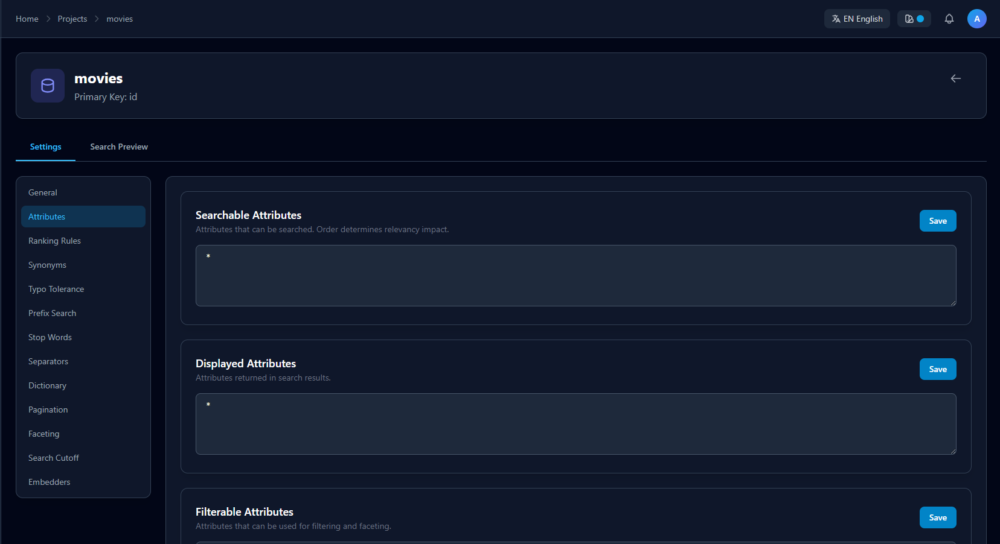
*完整的设置面板，采用左侧边栏导航*

**配置项包括：**
- 基础信息 (General)
- 属性配置 (Attributes)
- 排序规则 (Ranking Rules)
- 同义词 (Synonyms)
- 容错设置 (Typo Tolerance)
- 前缀搜索 (Prefix Search)
- 停止词 (Stop Words)
- 分隔符 (Separators)
- 字典 (Dictionary)
- 分页 (Pagination)
- 页大小 (Faceting)
- 搜索截止 (Search Cutoff)
- 向量化 (Embedders)

### 搜索预览

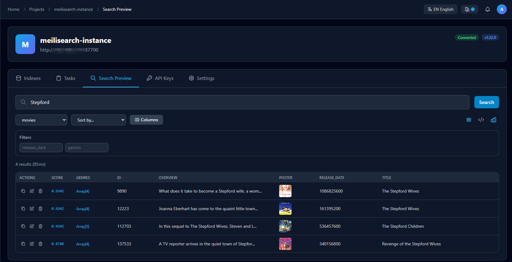 
*实时搜索测试，支持表格/JSON 视图和相关度评分*

**主要功能：**
- 表格视图 / JSON 视图切换
- 相关度评分 (Ranking Score) 展示
- 复制 JSON、编辑、删除文档
- 字段内容智能省略/展开
- 可选择展示列

### 任务监控

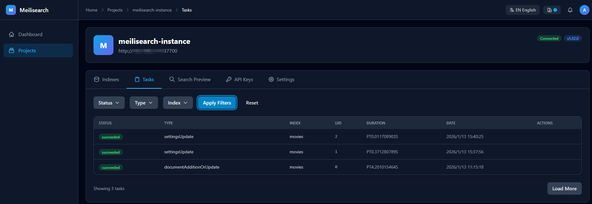 
*任务列表，支持状态筛选和详细信息查看*

**主要功能：**
- 按状态筛选（成功/失败/取消）
- 按索引筛选
- 按类型筛选
- 查看任务详情

### API 密钥管理

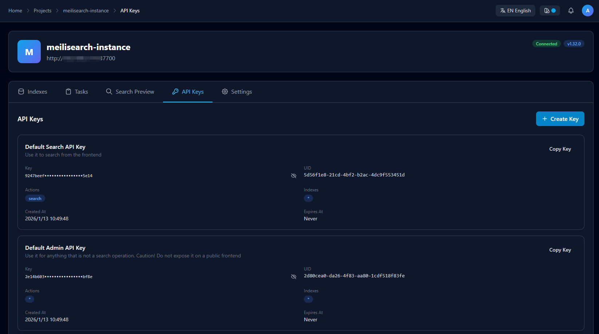
*API 密钥管理，支持显示/隐藏切换和权限控制*

**主要功能：**
- 密钥列表展示
- 小眼睛图标控制密钥显示/隐藏
- 创建新密钥（自定义权限）
- 删除密钥

### 主题支持

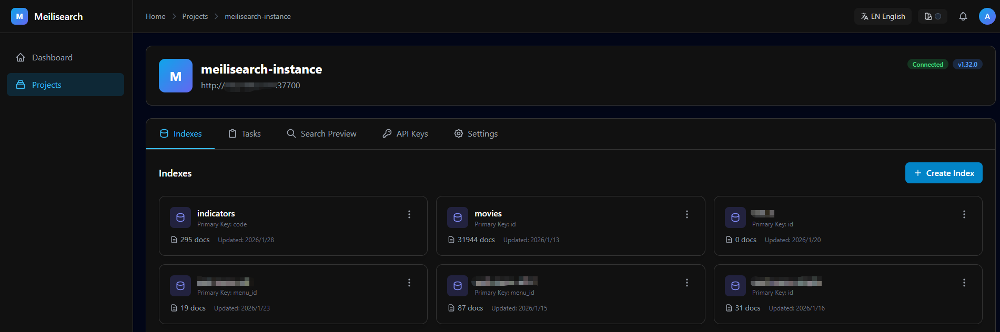
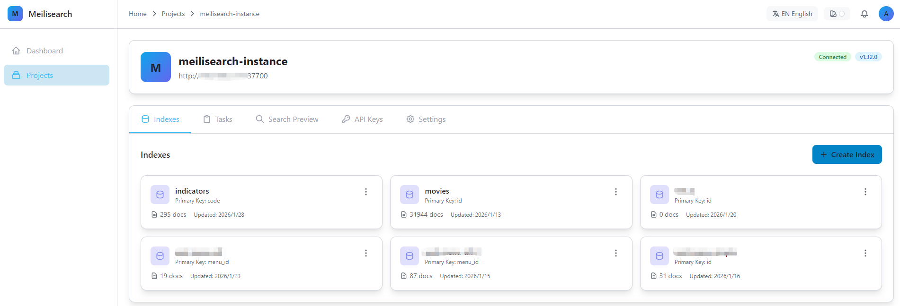
*多种主题选项：科技蓝、粉红、暗黑、白色*

### 国际化

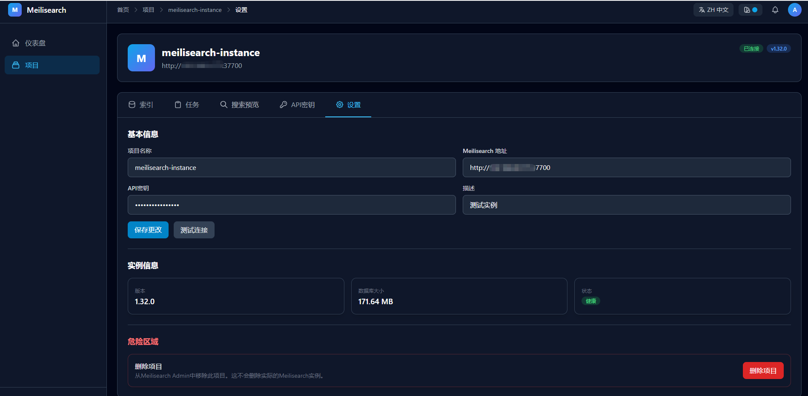
*多语言切换：English、中文*

## 配置说明

配置文件位于 `config/` 目录，使用 YAML 格式。

```yaml
# config/config.yaml
server:
  host: 0.0.0.0
  port: 5000
  debug: true

database:
  type: sqlite
  path: data/meilisearch_admin.db

logging:
  level: INFO
  path: logs/
```

### 环境变量

| 变量名 | 描述 | 默认值 |
|--------|------|--------|
| `FLASK_ENV` | 运行环境 | `development` |
| `DATABASE_URL` | 数据库连接字符串 | SQLite |
| `LOG_LEVEL` | 日志级别 | `INFO` |

## 参与贡献

欢迎提交 Pull Request 参与贡献！

1. Fork 本仓库
2. 创建特性分支 (`git checkout -b feature/AmazingFeature`)
3. 提交更改 (`git commit -m 'Add some AmazingFeature'`)
4. 推送分支 (`git push origin feature/AmazingFeature`)
5. 创建 Pull Request

## 开源协议

本项目基于 Apache License 2.0 协议开源 - 详见 [LICENSE](LICENSE) 文件。

---

<p align="center">
  <a href="#readme-top">返回顶部</a>
</p>
